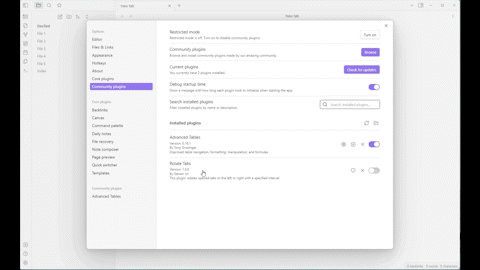

# Obsidian Tab Rotator

The Tab Rotator Plugin is an Obsidian plugin that enables users to rotate the currently opened tabs in their Obsidian workspace. With this plugin, users can easily move through their opened tabs by rotating them to the left or right, instead of manually clicking through each one.

## Features
Rotate tabs to the left or right with a specific interval

## Usage
Set the interval of tab rotation

<ol>
  <li>Enable/Disable by clicking the Tab Auto-Rotation Ribbon Icon (Rotate to the right)</li>
  Setting > Community Plugins > Tab Rotator > Interval 

  <li> Using Command Palette (Windows: Ctrl+P / MacOS: Cmd + P)
    <ol>
      <li>Enable Rotate tab to the right</li>
      <li>Enable Rotate tab to the left </li>
      <li>Stop tab rotation </li>
    </ol>
  </li>
</ol>

## Donating
