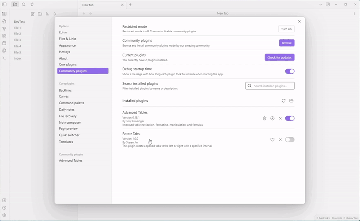
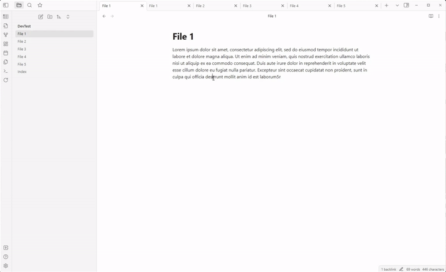

# Obsidian Tab Rotator

The Tab Rotator Plugin is an Obsidian plugin that enables users to rotate the currently opened tabs in their Obsidian workspace. With this plugin, users can easily move through their opened tabs by rotating them to the right or left, instead of manually clicking through each one.

## Features
Rotate tabs to the right or left with a specified interval

## Demo (Speed up)
**Enable by the ribbon button**\

\
\
**Enable rotating left by Command Palette**\

## Usage
Go to the Obsian Settings and set the interval of tab rotation (second) \
*Setting > Community Plugins > Tab Rotator > Interval*

### 1. Enable/Disable by clicking the Tab Auto-Rotation Ribbon Icon (Rotate to the right)
### 2. Enable/Disable using Command Palette (Windows: Ctrl+P / MacOS: Cmd + P) 
  * Start Rotating to the right 
  * Start Rotating to the left 
  * Stop tab rotation 

## Donating
